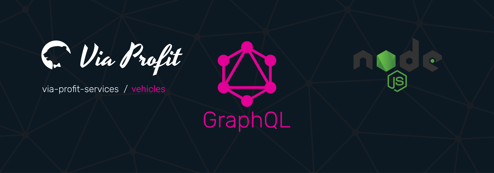

# Via Profit services / Vehicles



> Via Profit services / **Vehicles** - это пакет, который является частью сервиса, базирующегося на `via-profit-services` и представляет собой реализацию схемы работы с городами.


## TODO

- [ ] Описание методов класса сервиса
- [ ] CONTRIBUTING docs
- [ ] Тесты
- [ ] Subscriptions

## Содержание

- [Установка и настройка](#setup)
- [Как использовать](#how-to-use)
- [Подключение](#integration)


## <a name="setup"></a> Установка и настройка

### Установка

```bash
yarn add ssh://git@github.com:via-profit-services/vehicles.git#semver:^0.1.0
```

Список версий [см. здесь](https://github.com/via-profit-services/vehicles/-/tags)

### Миграции

1. После первой установки примените все необходимые миграции:

```bash
yarn knex:migrate:latest
```

После применения миграций будут созданы все необходимые таблицы в вашей базе данных

Заполнение таблиц данными происходит в ручном режиме. Это сделано для того, чтобы ваши миграции не содержали список стран и городов всего мира, а только те страны, которые требуются в вашем проекте.

2. Создайте файл миграций используя команду ниже:

```bash
yarn knex:migrate:make internal-vehicles-fill
```

3. Поместите код, указанный ниже, в созданный файл миграций. При необходимости скорректируйте набор стран, которые вы будете использовать

```ts
/* eslint-disable */
import { Knex } from '@via-profit-services/core';
import vehicles from '@via-profit-services/vehicles/dist/vehicles';

export async function up(knex: Knex): Promise<any> {
  return new Promise(async (resolve) => {
    await knex.raw(`
      ${knex('vehiclesMakes').insert(vehicles.makes).toQuery()}
      on conflict ("id") do update set
      ${Object.keys(vehicles.makes[0]).map((field) => `"${field}" = excluded."${field}"`).join(',')}
    `);

    await knex.raw(`
      ${knex('vehiclesModels').insert(vehicles.models).toQuery()}
      on conflict ("id") do update set
      ${Object.keys(vehicles.models[0]).map((field) => `"${field}" = excluded."${field}"`).join(',')}
    `);

    resolve();
  });
}

export async function down(knex: Knex): Promise<unknown> {
  return knex.raw(`
    delete from "vehiclesModels";
    delete from "vehiclesMakes";
  `);
}

```


## <a name="how-to-use"></a> Как использовать

Soon


### <a name="integration"></a> Подключение

Для интеграции модуля требуется задействовать типы и резолверы модуля, затем необходимо подключить Express middleware, поставляемое пакетом. Так же необходимо сконфигурировать логгер.

Модуль экспортирует наружу:

  - typeDefs - служебные Типы
  - resolvers - Служеюные Резолверы
  - Vehicles - Класс, реализующий модель данного модуля

Пример подключения:

```ts
import { App } from '@via-profit-services/core';
import { typeDefs, resolvers } from '@via-profit-services/vehicles';

const app = new App({
  ...
  typeDefs: [
    typeDefs,
  ],
  resolvers: [
    resolvers,
  ],
  ...
});
app.bootstrap();

```

